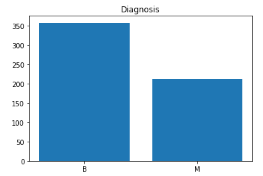
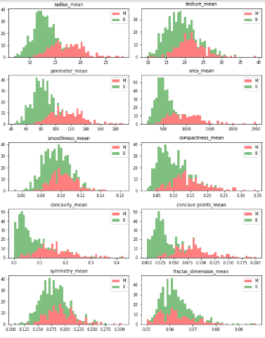

# Klasifikasi Kanker Payudara

## Domain Proyek
Kanker adalah salah satu penyebab kematian paling menonjol di seluruh dunia, terhitung lebih dari 1 juta kematian dalam setahun terakhir dari mana 22,6% kematian disebabkan oleh kanker payudara berdasarkan jurnal [*Breast Cancer Detection Using Machine Learning Techniques*](https://www.researchgate.net/publication/361024112_Breast_Cancer_Detection_Using_Machine_Learning_Techniques). Kanker payudara biasanya disebabkan oleh berbagai faktor klinis, gaya hidup, sosial, dan ekonomi. Mendeteksi kanker payudara tersebut ganas atau jinak sejak dini sangat perlu dilakukan agar mendapatkan tindakan medis yang tepat. *Machine learning* berpotensi memprediksi kanker payudara berdasarkan fitur yang tersembunyi dalam data.

Akan dibandingkan 2 model yang akan memprediksi kanker tersebut termasuk kanker jinak atau kanker ganas. Setelah dibandingkan hasil evaluasi akan diputuskan model terbaik untuk mendeteksi kanker ganas atau jinak.

## *Business Understanding*

### *Problem Statements*

- Bagaimana caranya mendeteksi bahwa kanker tersebut ganas ataupun jinak?
- Model *machine learning* apa yang cocok untuk mengklarifikasi kanker tersebut ganas ataupun jinak?

### *Goals*

- Dengan beberapa data dari inti sel yang pernah diuji, diharapkan bisa mendeteksi kanker tersebut apakah termasuk kategori ganas ataupun jinak menggunakan *machine learning* yang tepat
- Akan dibandingkan 2 model *machine learning* untuk mendapatkan hasil yang terbaik

## *Data Understanding*
Dengan menggunakan dataset dari *Breast Cancer Wisconsin (Diagnostic) Data Set* yang didalamnya terdapat 12 kolom yang terdiri dari 2 atribut dan 10 fitur yang akan kita latih, dan terdapat 569 row yang terdiri dari 357 diagnosa jinak, dan 212 ganas.

Fitur dihitung dari gambar digital dari aspirat jarum halus (FNA) dari massa payudara. FNA menggambarkan karakteristik inti sel yang ada pada gambar. Data dapat diunduh dari [*Breast Cancer Wisconsin (Diagnostic) Data Set*](https://archive.ics.uci.edu/ml/datasets/Breast+Cancer+Wisconsin+%28Diagnostic%29).

### Variabel-variabel pada *Breast Cancer Wisconsin (Diagnostic) Data Set* adalah sebagai berikut:
- *radius* : jarak dari pusat ke titik-titik pada keliling
- *texture* : standar deviasi nilai skala abu-abu
- *perimeter* : ukuran rata-rata tumor inti
- *area* : luas area sel kanker
- *smoothness* : variasi lokal dalam panjang radius
- *compactness* : keliling^2 / luas - 1,0
- *concavity* : keparahan bagian cekung dari kontur
- *concave points* : jumlah bagian cekung dari kontur
- *symmetry* : garis pembagi sel
- *fractal dimension* : perkiraan garis tepi - 1

## *Data Preparation*
Sebelum data digunakan, ada beberapa tahap yang dilakukan yaitu.

- *Feature distribution*:
   
   

    
   

   
    Memilih beberapa *feature* lalu menganalisa seberapa berpengaruh feature tersebut terhadap diagnosa. Dengan menggunakan grafik untuk melihat seberapa berpengaruh feature tersebut terhadap diagnosa dengan cara memisahkan dataframe berdasarkan diagnosa, lalu mengambil 10 feature yang akan digunakan (*real value*). Lalu membuat grafik dalam bentuk histagram. 
- *Target encoding*:
    Kolom diagnosa pada dataframe harus diubah dahulu dari indikator 'M' dan 'B' menjadi angka yaitu angka 1 dan 0 agar memudahkan dalam klasifikasi
- *Split train and test data*:
   Pelatihan model menggunakan 80 persen data latih (455 data latih) dan 20 persen data validasi (144 data validasi). Pembagian data menggunakan *function test_split_data* dari *library sklearn.model_selection*

## *Modeling*
Model yang diujicobakan ada 2, yaitu model *LogisticRegression* dan *RandomForest*. Hasil evaluasi dari kedua model ini akan dibandingkan dan diputuskan model yang mana yang terbaik untuk prediksi bahwa kanker payudara tersebut jinak atau ganas. Hasil akan disimpulkan pada poin evaluasi.
1. Penjelasan model yang akan digunakan:
    - *Logistic Regression*
        *Logistic Regression* merupakan pemodelan yang mencari hubungan antar feature melalui probabilitas hasil keluaran diskrit tertentu. Tipe *Logistic Regression* yang kita gunakan yaitu *Binary Logistic Regression* karena model yang dibuat hanya mengeluarkan 2 keluaran
    - *Random Forest* 
        *Random Forest* merupakan pemodelan yang menggabungkan keluaran dari beberapa decision tree untuk mencapai satu hasil. Alur dari algoritma ini yaitu :
            - Algoritma memilih sampel acak dari dataset yang disediakan.
            - Membuat decision tree untuk setiap sampel yang dipilih. Kemudian akan didapatkan hasil prediksi dari setiap decision tree yang telah dibuat.
            - Dilakukan proses voting untuk setiap hasil prediksi. Untuk masalah klasifikasi menggunakan modus (nilai yg paling sering muncul)
            - Algoritma akan memilih hasil prediksi yang paling banyak dipilih (vote terbanyak) sebagai prediksi akhir.
2. Proses:
    - Inisialisasi model yang akan dipakai serta memasukkan nilai parameternya
    - Mulai pelatihan data dengan model yang telah ditentukan
    - Menguji akurasi model yang telah dilatih menggunakan data latih
    - Menguji model latih menggunakan metode cross validation dengan mengguankan data validasi

3. *Hyperparameter*
    - *LogisticRegression*
        Model logisticRegression tidak benar-benar memiliki parameter kritis untuk disetel. Jadi tidak ada parameter yang diset untuk model ini
    - *RandomForestTree*
        Ada beberapa parameter yang diset yaitu:
        - *n_estimators* = 100
            Terdapat 100 pohon yang diset
        - *min_samples_split* = 25 
            Minimal terdapat 25 yang akan di split dalam 1 titik
        - *max_depth* = 7
            Kedalaman maksimal setiap pohon sampai 7
        - *max_features* = 2
            Maksimal 2 feature yang akan menjadi keputusan pada setiap pohon 

## *Evaluation*
Evaluasi menggunakan *KFold cross-validation*. Tahap untuk melakukan *K-Fold Validation* adalah sebagai berikut, data yang ada dibagi-bagi menjadi segmen yang berukuran sama atau mendekati, Selanjutnya data training untuk iterasi atau pengulangan dan data validasi dilakukan, sehingga dalam setiap iterasi lipatan data yang berbeda diperlukan untuk validasi sedangkan k1 lipatan yang tersisa digunakan untuk pembelajaran. Data dibagi menjadi tingkatan sebelum melakukan proses *K-fold*, menata ulang data untuk setiap lipatan data merupakan perwakilan yang sesuai dari keseluruhan data yang ada. Jadi setiap lipatan yang akan dilakukan terwakili oleh data keseluruhan yang ada, setiap *flip* yang dilakukan merupakan data terbaik yang telah diberikan berdasarkan persentase perwakilan data [*K-Fold Cross-Validation*](https://sis.binus.ac.id/2022/06/22/k-fold-cross-validation/).

Setelah dilakukan pengujian didapatkan hasil berikut ini:

*Logistic Regression*

- *Accuracy* : 85.93 %
- *Precision* : 84.17 %
- *Recall* : 78.33 %
- F1 : 80.30 %

*Random Forest*

- *Accuracy* : 90.35 %
- *Precision* : 88.50 %
- *Recall* : 85.83 %
- F1 : 86.98 %

Dari hasil tersebut dapat disimpulkan bahwa model *Random Forest* merupakan model yang tepat untuk memprediksi bahwa kanker payudara tersebut jinak atau ganas.

**---Terima Kasih---**

